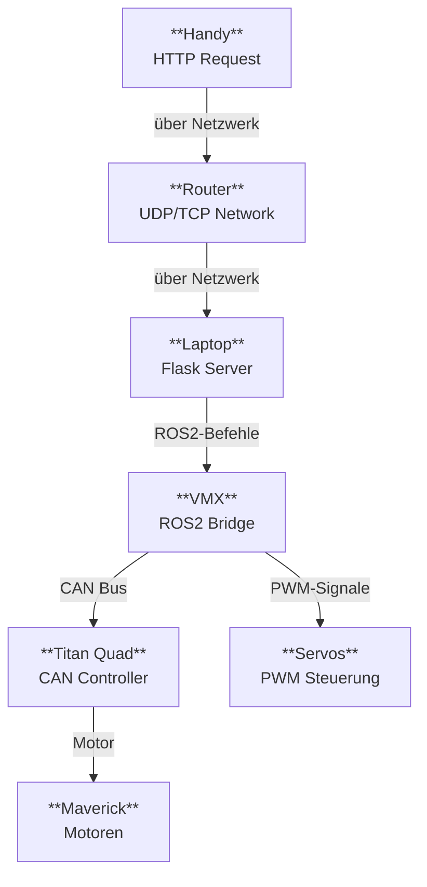

# Studica Roboter

> **Autor:** Merlin Ortner · **Version:** 1.1  
> **Zielgruppe:** Schüler ab der 9. Jahrgangsstufe, Studierende, Maker

---

## Wichtiger Hinweis zur Studica ROS-Software

> [!WARNING]
> Die Studica ROS2-Implementierung war zum Zeitpunkt der Erstellung dieser Dokumentation **sehr fehlerhaft**. Der hier dokumentierte Stand basiert auf einer **älteren, halb funktionierenden Version** des Studica-Knotens, da ein Update auf die neueste Version das gesamte System zum Absturz gebracht hat und ein Rollback nötig war.
>
> Bekannte Einschränkungen der verwendeten Version:
> - Der Knoten **muss als `sudo`-User ausgeführt** werden.
> - Das Paket muss **zweimal mit `colcon` gebaut** werden, damit es korrekt erkannt wird.
>
> **Contributions sind sehr willkommen!** Falls jemand die neueste Version des Studica-Knotens getestet hat und diese Fehler dort nicht mehr auftreten, wäre es toll, diese Dokumentation entsprechend zu aktualisieren.

---

## Inhaltsverzeichnis

- [1. Hardware](#1-hardware)
  - [1.1 VMX (Raspberry Pi + VMX HAT)](#11-vmx-raspberry-pi--vmx-hat)
  - [1.2 Titan Quad (Motor Controller)](#12-titan-quad-motor-controller)
  - [1.3 Servo Block](#13-servo-block)
  - [1.4 Maverick Motor](#14-maverick-motor)
  - [1.5 Servo Motor](#15-servo-motor)
  - [1.6 Batterie](#16-batterie)
- [2. Software](#2-software)
  - [2.1 Betriebssystem](#21-betriebssystem)
  - [2.2 ROS2 (Robot Operating System)](#22-ros2-robot-operating-system)
  - [2.3 Studica Control – Installation](#23-studica-control--installation)
  - [2.4 Zusätzliche Pakete](#24-zusätzliche-pakete)
  - [2.5 Troubleshooting](#25-troubleshooting)

---

## 1. Hardware

Der Studica-Roboter basiert auf einer modularen Hardwarearchitektur, die für den Einsatz in schulischen und universitären Robotikprojekten entwickelt wurde. Im Zentrum steht ein **Raspberry Pi 4B**, erweitert durch das **VMX-Pi-Modul** als zentrale Rechen- und Schnittstelleneinheit. Die Motorsteuerung übernimmt der **Titan Quad Motor Controller**.

---

### 1.1 VMX (Raspberry Pi + VMX HAT)

Der VMX ist der Computer des Roboters. Er besteht aus:

- **Raspberry Pi 4B** – der eigentliche Einplatinencomputer
- **VMX-Pi HAT** – ein Aufsteckmodul (Hardware Attached on Top), das in die 40-Pin-Leiste des Pi gesteckt wird

Die Verbindung zum Titan Quad erfolgt über **CAN-Bus**. Dabei müssen die Kabel korrekt angeschlossen werden:

| Kabel | Farbe | Beschriftung am Anschluss |
|-------|-------|---------------------------|
| CAN Low | Grün | L = GRN = green |
| CAN High | Gelb | H = YEL = yellow |

**Stromversorgung:** Der VMX wird über den 12V-Connector des Titan Quad mit Strom versorgt.

**Anschlüsse am Raspberry Pi 4B:**

| Anschluss | Beschreibung |
|-----------|--------------|
| USB-C (1) | Direkte Stromversorgung (z. B. beim Arbeiten ohne Titan Quad) |
| Micro-HDMI (2 & 3) | Bis zu 2 Bildschirme (Adapter benötigt) |
| 3,5mm AV (4) | Audio- oder analoges Videosignal |
| USB-A 3.0 (3 & 4) | Schnelle Geräte (Webcams etc.) |
| USB-A 2.0 (1 & 2) | Einfache Geräte (Tastatur etc.) |
| Ethernet (5) | Netzwerkanbindung / SSH |


> [!NOTE]
> Das direkte Einbinden des Roboters in das Schulnetzwerk ist **nicht empfohlen**, da der Pi dann als Ubuntu-Server im Netzwerk auftritt und dieses belasten würde. Besser: eigener Router oder Laptop als Gateway (siehe [2.2](#22-ros2-robot-operating-system)).

Der Lüfter lässt sich durch Aus- bzw. Einstecken eines bestimmten Kabels am VMX ein- und ausschalten. Beim Auseinandernehmen des VMX auf die **Reihenfolge der Teile von oben nach unten** achten.


---

### 1.2 Titan Quad (Motor Controller)


Der **Titan Quad** ist der Motor Controller des Roboters. Er:

- steuert die Kommunikation zwischen Software, Motoren und Sensoren
- versorgt den Servo Block und den Raspberry Pi mit Strom (Ausgänge 1 & 2)
- nimmt bis zu **zwei Batterien** gleichzeitig auf (Eingänge 3 & 4)

**Sicherungen (Fuses):** Für jeden Motor befindet sich eine eigene Sicherung auf dem Titan Quad (Positionen 5–10). Bei einem Kurzschluss löst die Sicherung aus (vergleichbar mit einer Haushaltssicherung). Der Fuse-Switch muss danach wieder mittig eingerastet werden, damit die Motoren wieder funktionieren.

---

### 1.3 Servo Block


Der **Servo Power Block** versorgt die Servo-Motoren mit Strom (12V vom Titan Quad) und steuert diese.

**Verkabelung der Servos:**

| Signal | Farbe |
|--------|-------|
| GND (–) | Schwarz |
| VCC (+) | Rot |
| Signal (S) | Weiß |

Die Servos werden mit dem **schwarzen Kabel nach oben** in den Servo Block gesteckt.

- **Output-Seite:** Servos einstecken (3-Pin-Connector)
- **Input-Seite:** 3-Pin-Kabel zum VMX-Pi in einen der Channels **12–21**


> [!CAUTION]
> Servos **nicht direkt in den VMX** stecken! Die höhere Spannung kann die Servos beschädigen. Immer den Servo Block als Zwischenstufe nutzen.

---

### 1.4 Maverick Motor


Der Roboter nutzt bis zu **vier Maverick-Motoren** zum Antrieb der Räder.

**Verkabelung:**

Es gibt zwei Kabeltypen pro Motor:

- **Stromkabel** (dick, rot & schwarz) → in die Seite des Titan Quad, nach Farben zuordnen
- **Encoder-Kabel** → in die obere Reihe des Titan Quad (beschriftet mit `ENC`)

Farbzuordnung der Encoder-Kabel:

| Signal | Farbe |
|--------|-------|
| + (VCC) | Rot |
| A | Blau |
| – (GND) | Schwarz |
| B | Gelb |


> [!TIP]
> Bei **Falschpolung** dreht sich der Motor einfach nicht – kein Schaden entsteht. Die Abbildung auf dem Titan Quad hilft bei der korrekten Zuordnung.


---

### 1.5 Servo Motor


Im Set sind **sechs Servos** enthalten: **3× Torque** und **3× Fast**.

| Eigenschaft | Torque Servo | Fast Servo |
|-------------|-------------|------------|
| Gear Ratio | 1:67 | 1:300 |
| No Load Speed | 0,25 s/60° (40 RPM) @ 4,8V · 0,2 s/60° (50 RPM) @ 6V | 0,057 s/60° (175 RPM) @ 4,8V · 0,046 s/60° (217 RPM) @ 6V |
| Stall Torque | 180,85 oz-in @ 4,8V · 300 oz-in @ 6V | 47,2 oz-in @ 4,8V · 69,5 oz-in @ 6V |

**Wann welchen Typ verwenden?**

- **Torque** → hohe Last, langsame Bewegung (z. B. Greifer)
- **Fast** → geringe Last, schnelle Bewegung (z. B. Kameraschwenk)

> Beide Servo-Typen haben einen **Drehbereich von 300°** (–150° bis +150°) und lassen sich über ROS2 nicht kontinuierlich ansteuern. Der Fast-Servo hat durch die Getriebeübersetzung einen real größeren Drehbereich.

---

### 1.6 Batterie

Das Set enthält **zwei 12V 3.000mAh NiMH-Akkus**.

- Es lässt sich jeweils **nur einer gleichzeitig aufladen**
- Volladung erkennbar an der **grünen LED am Netzteil**
- Am Titan Quad lassen sich **bis zu zwei Akkus gleichzeitig anschließen**

**Akkuwechsel ohne Neustart:** Wenn der Akku zur Neige geht (erkennbar an nachlassender Motor-Reaktion), zunächst den **vollen Akku anschließen**, dann erst den leeren abziehen. So bleibt das System am Laufen.

> [!WARNING]
> **Sicherheitshinweis Akku:** Nur mit dem mitgelieferten Netzteil laden! Den Akku nicht durchstechen oder beschädigen. Bei ungewöhnlicher Erhitzung sofort eine Lehrkraft benachrichtigen und den Akku sicher ablegen.

---

## 2. Software

### 2.1 Betriebssystem

Das Betriebssystem liegt auf der **Micro-SD-Karte im VMX-Pi**.

Empfohlen wird **Ubuntu 22.04.5**. Da keine Desktop-Features benötigt werden, ist die **Server-Variante** vorzuziehen (leichter, weniger Speicherverbrauch).

Ein vorgefertigtes Image mit vorinstalliertem ROS Humble ist verfügbar unter:  
➤ [Studica Image Download](https://studicalimited.sharepoint.com/:u:/s/SR-Resources/EQwRu3CDfj5OpjdC6XNUwFQB8HDwnFssPixJreXBGmxlUw?e=cPI0Za&download=1)

Eine Server-Variante des Images ist offiziell nicht verfügbar, lässt sich aber selbst bauen.

**Image auf SD-Karte flashen:** Mit [Balena Etcher](https://etcher.balena.io/) oder dem [Raspberry Pi Imager](https://www.raspberrypi.com/software/) – SD-Karten-Reader erforderlich.

---

### 2.2 ROS2 (Robot Operating System)

**ROS2** (Robot Operating System 2) ist keine klassisches Betriebssystem, sondern eine Sammlung von Libraries und Tools zur Robotersteuerung. Für den Studica-Roboter wird **ROS2 Humble** benötigt.

Das Studica-Paket für die Titan-Quad-Schnittstelle:  
➤ [github.com/Studica-Robotics/ROS2](https://github.com/Studica-Robotics/ROS2?tab=readme-ov-file)

#### Verbindung zum Roboter per SSH

**Empfohlenes Netzwerk-Setup (ohne Schul-Router):**

Unter den LAN-Einstellungen des Laptops → IPv4 → `Shared to other computers` aktivieren. Dadurch bekommt der Pi automatisch eine eigene IP, und der Laptop teilt seine Internetverbindung.

Alternativ: Eigenen Router verwenden (nicht im Schulnetzwerk!).

**IP des Raspberry Pi herausfinden** (Monitor anschließen und eingeben):

```bash
hostname -I
```

Je nach Verbindungsart:
- LAN → IP beginnt mit `10.xx.xx.xx`
- WLAN → IP beginnt mit `192.168.xxx.xxx`

**Verbindung herstellen:**

```bash
ssh vmx@<IP-Adresse>
# Beispiel: ssh vmx@10.42.0.100
```

---

### 2.3 Studica Control – Installation

> [!IMPORTANT]
> Aufgrund der bekannten Bugs (siehe Hinweis am Anfang) **muss der gesamte Prozess als `sudo`-User ausgeführt werden** und `colcon build` muss **zweimal aufgerufen** werden.

Sobald per SSH verbunden:

```bash
# 1. Repository klonen
git clone https://github.com/Studica-Robotics/ROS2.git

# 2. Zu sudo wechseln (zwingend erforderlich!)
sudo su

# 3. In das ROS-Verzeichnis wechseln
cd /home/vmx/ROS/

# 4. Setup-Skript ausführbar machen und starten
chmod +x setup.sh
./setup.sh -lce
# Das Flag -lce installiert nur die benötigten Pakete. Weglassen für vollständige Installation.
```

#### Parameter konfigurieren

Die Datei `/home/vmx/ROS/src/studica_control/src/config/params.yaml` muss mit den korrekten Motorenanschlüssen befüllt werden. Eine vorbereitete Konfigurationsdatei mit Standardwerten für Servos und Motoren:  
➤ [params.yaml (Google Drive)](https://drive.google.com/file/d/1hRFcBtDjmj0UlX-uMpQ_SxCeIMZfSw4R/view?usp=sharing)

#### Paket bauen und starten

```bash
# Paket bauen (bei Bedarf zweimal ausführen, falls colcon das Paket beim ersten Mal nicht erkennt)
colcon build --symlink-install --packages-select studica_control

# Umgebung sourcen
source install/setup.bash

# System starten
ros2 launch studica_control studica_launch.py
```

#### Roboter steuern

Fahrbefehle werden als **Twist-Nachrichten** auf das Topic `/cmd_vel` veröffentlicht, z. B. mit:

```bash
# Tastatursteuerung (Paket muss installiert sein)
ros2 run teleop_twist_keyboard teleop_twist_keyboard
```

Servos über den ROS2 Service ansteuern:

```bash
ros2 service call /<servo_name>/set_servo_angle studica_control/srv/SetData "{params: '45'}"
# servo_name ist in params.yaml definiert, standardmäßig: servo1 oder servo2
```

---

### 2.4 Zusätzliche Pakete

Die folgenden Pakete wurden im Rahmen dieses Projekts entwickelt und erweitern den Funktionsumfang des Studica-Roboters.

---

#### 2.4.1 Servo Helper

Da das Studica-Paket Servo-Befehle nur über ROS-Services entgegennimmt, ist eine netzwerkübergreifende Steuerung per Topic nicht direkt möglich. Das Paket `servo_helpers` schließt diese Lücke: Es subscribed ein ROS-Topic und leitet die Daten an das Studica-Interface weiter.

**Repository:** [github.com/Merlin2LmmL/servo-helpers](https://github.com/Merlin2LmmL/servo-helpers)

**Installation (auf dem Pi):**

```bash
cd /home/vmx/ROS/src/
git clone https://github.com/Merlin2LmmL/servo-helpers servo_helpers
```

Paket bauen (aus dem `ROS/`-Verzeichnis):

```bash
colcon build --symlink-install --packages-select servo_helpers
source install/setup.bash
```

**Verwendung:**

```bash
# Relay-Node starten
ros2 run servo_helpers servo_relay_node --ros-args -p servo_name:=<servo_name>

# Winkel senden
ros2 topic pub --once /<servo_name>/angle_cmd std_msgs/msg/Int32 "{data: <winkel>}"
# Beispiel: ros2 topic pub --once /servo1/angle_cmd std_msgs/msg/Int32 "{data: 45}"
```

---

#### 2.4.2 Flask-Server (Web-Steuerung)

Zur komfortablen Steuerung des Roboters über eine Web-Oberfläche kann ein lokaler **Flask-Server** auf dem Laptop laufen. Damit ist die Steuerung von jedem Gerät im selben Netzwerk aus möglich – inklusive Live-Kamerabild.

**Repository:** [github.com/Merlin2LmmL/FlaskRobotControl](https://github.com/Merlin2LmmL/FlaskRobotControl)

**Installation (auf dem Laptop):**

```bash
git clone https://github.com/Merlin2LmmL/FlaskRobotControl.git
cd FlaskRobotControl
pip install -r requirements.txt
```

**Server starten:**

```bash
python3 app.py
```

Anschließend im Browser öffnen:
- Lokal: `http://127.0.0.1:8000`
- Von anderen Geräten im Netzwerk: die beim Start angezeigte IP-Adresse verwenden

**Kommunikationsdiagramm:**

# System Architecture



---

#### 2.4.3 Launch-Skript

Um alle nötigen Knoten mit einem einzigen Befehl zu starten, wurde ein Shell-Skript erstellt, das mehrere Terminals und Nodes gleichzeitig verwaltet.

**Skript herunterladen:**
```bash
curl -fsSL -o lanch.sh https://raw.githubusercontent.com/DBG-Robots/Studica_Robot/main/lanch.sh
```

**Einrichten (auf dem Pi):**

```bash
nano /home/vmx/ROS/launch.sh   # Inhalt des heruntergeladenen Skripts einfügen und speichern
chmod +x /home/vmx/ROS/launch.sh
```

**Verwendung:**

```bash
# Aus dem ROS-Verzeichnis heraus:
./launch.sh        # Startet den Studica Driver

# Mit Flags:
./launch.sh -s     # Studica Driver + Servo Controller
./launch.sh -c     # Studica Driver + Kamera
./launch.sh -k     # Alle gestarteten Nodes stoppen
```

---

#### 2.4.4 Controller-Steuerung (Joy-to-Twist)

Als Alternative zum Flask-Server lässt sich ein **Gamepad/Controller** zur Steuerung nutzen. Da ROS2 `/joy`-Nachrichten nicht direkt als Fahrbefehle versteht, konvertiert dieses Skript die Controller-Eingaben in `Twist`- und Servo-Befehle.

**Repository:** [github.com/Merlin2LmmL/joy-to-twist](https://github.com/Merlin2LmmL/joy-to-twist)

**Installation (auf dem Laptop):**

```bash
git clone https://github.com/Merlin2LmmL/joy-to-twist
```

**Starten:**

```bash
# Joy-Node starten (Controller-Treiber)
ros2 run joy joy_node

# In einem zweiten Terminal das Konvertierungsskript starten
python3 joy_to_twist.py
```

---

#### 2.4.5 Quickstart

Voraussetzung: Alle Pakete sind korrekt installiert und das Setup wurde abgeschlossen.

**Mit Flask-Server:**

```bash
# 1. SSH-Verbindung zum Roboter herstellen
ssh vmx@<IP-Adresse>

# 2. Zu sudo wechseln
sudo su

# 3. Ins ROS-Verzeichnis
cd ROS

# 4. Alle nötigen Nodes starten (mit Servos und Kamera)
./launch.sh -s -c

# 5. Auf dem Laptop: Flask-Server starten
python3 app.py

# 6. Browser öffnen → angezeigte IP-Adresse eingeben
```

**Mit Controller:**

Schritte 1–4 identisch, dann statt Flask-Server:

```bash
ros2 run joy joy_node
python3 joy_to_twist.py
```

---

### 2.5 Troubleshooting

#### `colcon build` schlägt fehl / Paket wird nicht erkannt

Dieses Verhalten ist ein bekannter Bug der verwendeten Studica-Version. Lösung: `colcon build` **ein zweites Mal ausführen**:

```bash
colcon build --symlink-install --packages-select studica_control
source install/setup.bash
ros2 launch studica_control studica_launch.py
```

Wenn das Paket beim zweiten Build-Versuch korrekt erkannt wird, ist das ein Zeichen, dass der Bug zutrifft.

#### Nodes starten nicht / Permission denied

Der Studica-Knoten **muss als `sudo`-User** gestartet werden:

```bash
sudo su
# Danach alle Befehle als Root ausführen
```

#### Keine Verbindung per SSH

- Prüfen, ob Roboter und Laptop im gleichen Netzwerk sind
- IP mit `hostname -I` am Roboter kontrollieren (Monitor anschließen)
- Falls kein Router vorhanden: Laptop-LAN-Einstellung auf `Shared to other computers` setzen

#### Motor dreht sich nicht

- Encoder-Kabelfarben prüfen (Falschpolung → Motor bleibt still, kein Schaden)
- Sicherung (Fuse) am Titan Quad prüfen → ggf. Fuse-Switch wieder einrasten

---

## Lizenz / Contributing

Dieses Repository dokumentiert ein schulisches Robotikprojekt. Verbesserungen, Korrekturen und insbesondere **Updates für neuere Versionen des Studica-Knotens** sind herzlich willkommen – einfach einen Pull Request öffnen!
